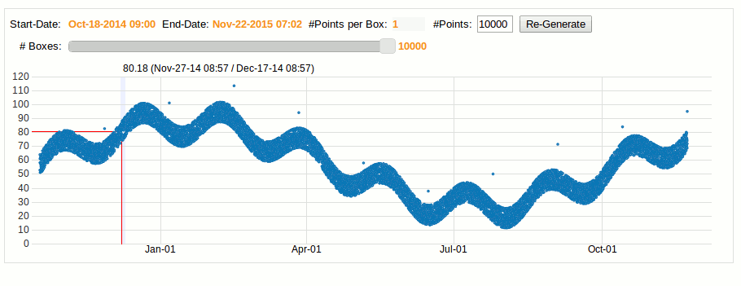
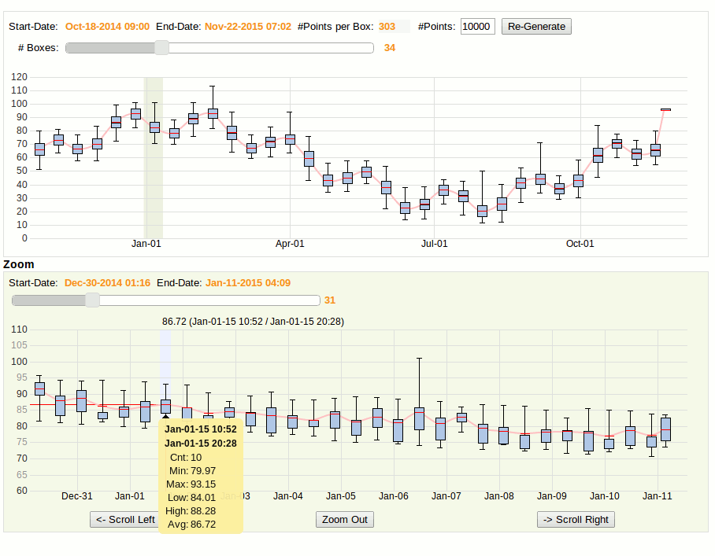
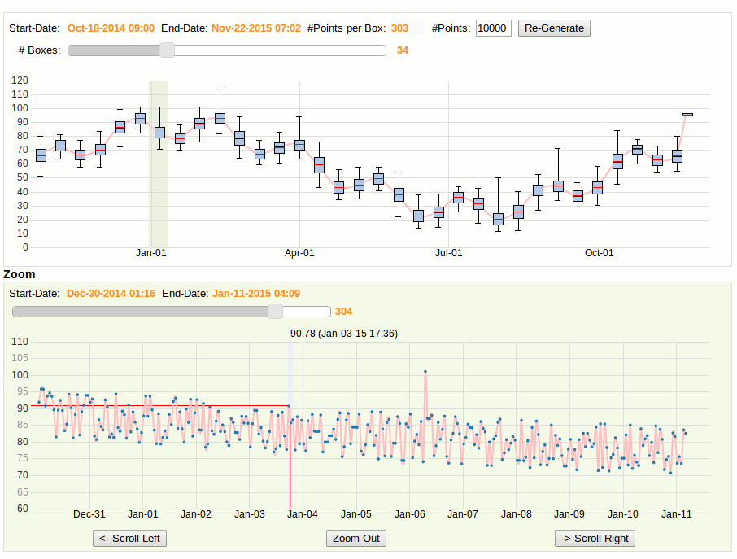

# boxcharts
boxchart-graph
==============

**Fast Rendering of large time-series on interactive graphs using Box Plot  (or Improved Time-Series Visualization using  'Time' to 'Frequency' Transformation)**

Displaying time-series graphs on browsers using javascript works very well until the number of points gets too large. Trying to display 
hundreds of thousands of points is very slow and hard to read. 
For time-series, this can be solved by allowing the user to see only a subset of the data (time-window). This
can be time consuming because not all the data is shown: The user has to 'blindly' scroll until 'interesting' data is found.

Of course, it's possible to just send averages to the browser and aggregate a fixed number of points (minutes, hours etc..) on the server.
This solves the speed problem because aggregation on the server can be very fast, but information is lost, 
for example outliers that are far from the average or the general distribution of the points in the aggregation.

What we want is a graphing tool that still allows the user to control the visualization, but instead of controlling which time-window is 
displayed, the user sees all the data but controls the aggegation 'density' of the visualization. The density aggregation transformation is 
generated in real-time on the server (A little bit like a Fourier transformation that convert from time to frequencies).

Here is a prototype of this solution:
Tis prototype will generate boxplots (also called box&whiskers http://en.wikipedia.org/wiki/Box_plot) on the server and store in 
each box the average, min, max, low, high, median and # of points. The aggregation level will be controlled by the browser
and it will be interactive so that the user can change the aggregation level dynamically and drill-down/explode a selected boxplot.
This allows to visualize the time-series with little degradation and still be able to quickly drill-down from box to points. Other visualizaton technique like color-density graph could be used but boxpot gives a visual representation of
the statistical distribution of the points in each box (min,max..) with the average of the box in red. It also attempt to
connect the averages using an interpolation function.

Here is an example with 10K points and the detail-level at 100% where all the 10K points are displayed: The shape
of the graph is clear, the outliers are visible but the rendering of the page is very slow (~6 secs) and it's hard to select anything. 10K points 
is small and it's already inconvenient.

With the aggregation level set to 34, the server only sends 34 boxes, each with information about 303 points: The graph is more readable,
rendering is instantaneous, the outliers are still visible and it's easy to drill-dow. Outliers (min or max) are seen as long 'whiskers'. The height of each box represent the location of the middle 50% of the points in the box. The red line is the average and the black like (in the box) is the median.
[Re-Generate] can be used to generate a different number of points on the server.

When adjusting the Zoom page to show all the points, the normal graph is shown for the region selected. Only 304 points
are displayed so rendering is still fast. Panning right/left can be done on the Zoom page at every aggregation level
while highlighting the zoom region on the main graph.

This prototype begs the question 'Why give the user the option to control the aggregation? Can the software just pick a reasonable aggregation?'.
This is interesting. Lets conpare the 2 methods:
1-Time-window control: This is the traditional visualisation where all the points are shown but only for a time-subset of the data. Since there is too
  many data, only a subset is displayed and it's the user's responsibility to find interesting data by moving the time-window. Since the software
  does not really know what the user is looking for, it allows the user to 'wonder' around in time.

2-Density Control: Here all the data is shown but the density aggregation is left to the user. This is required because the software does not try to
  analyze the 'randomness' of the data. If the data is very tight, it's shape can be visualized with a very few box&whiskers. But if the data has
  much more variability, then a good visualization will require more box&whiskers. Instead of trying to guess the right aggregation level, the 
  software allows the user to select the aggregation and recalculate the points on the server. The steps are similar to the 'Time-window' approach
  (display a new time-window vs display a different aggregation) but the end-result is more usefull: no more wandering yet still fast rendering.

This prototype generate points in the shape of 2 waves with outliers every 1000 points.

To run the application, install gem,ruby,sinatra-contrib and run:
$ ./boxchart.rb

then point your chrome browser to localhost:4567/

Todo: Adding reactivity  to the graph (for example with Websocket/Ractivejs or Vert.x) makes it even more interesting
because while the number of points is increasing over time, the graph can still remain at the same granularity. 

